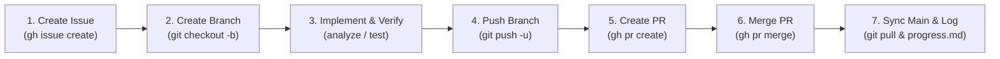

# Agent Operating Workflow & Protocol

> **CRITICAL INSTRUCTION FOR ALL AI CODING AGENTS (Antigravity, Cursor, Cline, Copilot, etc.)**
> This document defines the mandatory workflow that must be strictly followed when working on any repository in the WavePass ecosystem (`WavePass-Android`, `WavePass-Backend`, `WavePass-Web`, `wavepass`).

---

## 1. Core Rules & Constraints

1. **Git Identity**:
   - **Username**: `icedmist`
   - **Email**: `talk2icedmist@gmail.com`
   - Ensure commits always reflect this author identity:
     ```bash
     git config user.name "icedmist"
     git config user.email "talk2icedmist@gmail.com"
     ```
2. **Never Run Browser Agent**:
   - Do not execute or delegate tasks to browser agents under any circumstances.
3. **Preserve Documentation & Memory**:
   - Always maintain and update `progress.md` to record completed milestones, issues resolved, PRs merged, and pending tasks.
4. **No Major Architectural Modifications Without User Knowledge**:
   - Stick strictly to user requirements. Do not introduce unauthorized third-party dependencies, rewrite existing architecture, or remove core features without explicit confirmation.

---

## 2. Mandatory Issue-Branch-PR-Merge Lifecycle

Before writing or fixing code for **any** issue, feature, or bug across **all** repositories, you **MUST** follow this exact multi-step lifecycle:



### Step 1: Check Existing Issues or Create a New GitHub Issue
Before touching any code, check open issues:
```bash
gh issue list
```
If an issue does not already exist for the task, create one:
```bash
gh issue create \
  --title "<type>(<scope>): <concise title>" \
  --body "### Description\n<Detailed explanation of bug or missing feature>\n\n### Acceptance Criteria\n- [ ] Criterion 1\n- [ ] Criterion 2\n\n### Proposed Fix\n<Summary of technical plan>"
```
Note the issue number (e.g., `#2`).

### Step 2: Create a Dedicated Feature or Fix Branch
Ensure local `main` is up to date, then branch off:
```bash
git checkout main
git pull origin main
git checkout -b <type>/<kebab-case-description>
```
*Examples:*
- `fix/router-setup-reliability`
- `feat/voucher-cutout-cards-qr`
- `fix/socket-leak-cleanup`

### Step 3: Implement & Verify
1. Apply targeted changes.
2. Verify with static analysis and test suites:
   - Flutter: `flutter analyze` and `flutter test`
   - Node/TypeScript: `npm run lint` and `npm test`
3. Resolve all warnings and test failures before committing.

### Step 4: Commit with Conventional Commits
```bash
git add <modified-files>
git commit -m "<type>(<scope>): <clear description>"
```
*Types:* `feat`, `fix`, `refactor`, `perf`, `docs`, `test`, `chore`.

### Step 5: Push Branch to Remote
```bash
git push -u origin <branch-name>
```

### Step 6: Create Pull Request
Create the PR referencing the issue:
```bash
gh pr create \
  --title "<type>(<scope>): <title>" \
  --body "Closes #<issue-number>\n\n### Summary\n<Bullet points of changes>\n\n### Verification\n- Analyzed with 0 warnings/errors\n- Tests passed"
```

### Step 7: Merge the Pull Request
Once approved and CI checks pass, merge the PR and delete the remote branch:
```bash
gh pr merge --squash --delete-branch
```
*(Or `--merge --delete-branch` depending on repository convention).*

### Step 8: Return to Main & Synchronize
```bash
git checkout main
git pull origin main
```

### Step 9: Update Persistent Memory (`progress.md`)
Record the issue number, PR link, commit hash, and summary of changes in `progress.md`.

---

## 3. WavePass Technical Standards & Best Practices

- **Cleartext Traffic for Local Hardware**:
  - Android 9+ blocks HTTP by default. For local RouterOS REST API communication (`http://192.168.88.1`), ensure `android:usesCleartextTraffic="true"` is preserved in `AndroidManifest.xml`.
- **Resource Management**:
  - Always close `http.Client()` instances in `try-finally` blocks.
- **Asynchronous Safety**:
  - Always guard `setState()` calls with `if (!mounted) return;` or `if (mounted)`.
  - Concurrency locks (e.g. `_isRefreshing`, `_isGenerating`, `_isConfiguring`) must be used to prevent re-entrant loops during timer refreshes or rapid taps.
- **Error Handling**:
  - Never swallow exceptions silently in empty `catch (_) {}` blocks when user feedback is required. Surface informative error messages or fallback options.
